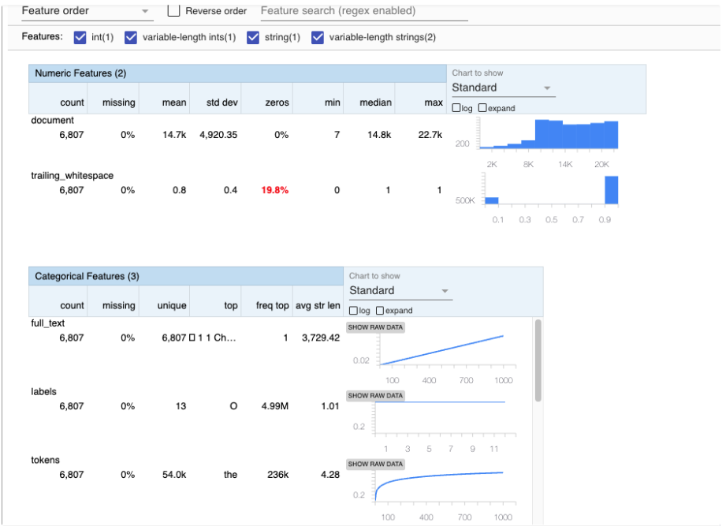
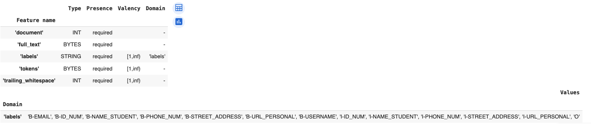

# Personally Identifiable Information Detection in Student Writing
[Sai Akhil Rayapudi](https://github.com/rayapudisaiakhil)
[Jayatha Chandra](https://github.com/jayathachan)
[Lahari Boni](https://github.com/LahariBoni)
[Vinesh Kumar Gande](https://github.com/vineshgvk)
[Abhigna Reddy](https://github.com/Abhignareddy7211)
[Siddharthan Singaravel](https://github.com/SiddharthanSingaravel)

# Introduction
## Business Problem :
The advent of AI heightens the risk of data and identity theft, with many scams stemming from data breaches and stolen Personally Identifiable Information (PII).

Post-pandemic, there has been a significant shift among educational institutions towards online teaching and the widespread adoption of digital tools for various academic activities. Between 2016 and 2020, thousands of students had their personal information compromised, including grades and Social Security numbers, leading to various forms of harm​ ​. E-Learning platforms, which have gained immense popularity due to their affordability and high-quality education, must prioritize the security of Personally Identifiable Information (PII).

These platforms must prioritize the security of Personally Identifiable Information (PII), particularly as students frequently share sensitive data during their academic interactions. The protection of this data is crucial to prevent students from falling victim to scams, particularly affecting vulnerable groups like job seekers and immigrants.

In 2022 alone, the education sector saw a 44% increase in cyberattacks, marking it as the most targeted industry for such incidents. This dramatic rise illustrates the urgent need for enhanced security measures.

## Potential AI Solution:

In this project, we work on identifying Personally Identifiable Information (PII) in textual data , especially when it’s embedded in the extensive personal details often found in Student Essays. Despite the critical importance of protecting PII, detecting it within vast amounts of textual data poses a significant challenge. Manual inspection is inefficient, impractical, and laborious. Keyword searches often overlook PII's complexity and variability.

With the exponential growth of text data and the complexities of PII detection, there is an urgent need for sophisticated and automated methods. Hence, Machine learning emerges as a pivotal solution, offering the accuracy and automation required to adeptly detect and secure PII within vast textual databases.

We will explore key exploratory data analysis techniques and adopt a hybrid approach for PII detection. We plan to integrate Regex for basic detection, augment NER with deep learning for refined accuracy, and leverage transformer models for sophisticated PII analysis.

Our goals comprise data pipeline preparation, ML Model Training, and ML Model updates to capture the evolving trends. We plan to assess data and concept drifts for sustained model efficacy and demonstrate the CI/CD process, ensuring streamlined model updates and optimizations.

We are moving towards a future where every action and interaction of ours will be a data point, fundamentally shaping how we navigate and understand the world. Thus, our PII detection project marks a genuine leap forward in the realm of data privacy and security. Our future focus includes real-time monitoring, privacy-preserving techniques, and compliance features to swiftly respond to breaches and meet global regulations. Our core mission is to promote trust and ethical data practices in today's data-driven landscape, ensuring a safer and better world for everyone!

## Dataset Information

This Dataset is featured by The Learning Agency Lab in Kaggle. It consists of approximately 6800 essays authored by students participating in a massively open online course. Each essay was crafted in response to a unified assignment prompt, prompting students to integrate course content with real-world challenges. Supplementary data are available for this project, which may be incorporated into the analysis if additional data are needed to enhance model performance. To facilitate ongoing model refinement, the dataset will be partitioned into a stream of data points, ensuring a continuous supply of data for further training as the model's performance metrics fluctuate. Currently, the plan entails periodic retraining and data retrieval every month.

## Data Card

Shape: 6807 * 5

| Variable Name      | Data Type | Description                                                  |
| ------------------ | --------- | ------------------------------------------------------------ |
| Document           | int       | An integer identifier for the essay                          |
| full_text          | string    | A UTF-8 representation of the essay                          |
| tokens             | list      | Each word of string type stored in a list                    |
| trailing_whitespace| list      | A list of boolean values indicating whether each token is followed by whitespace |
| labels             | list      | A token label in BIO format                                  |

The labels being the target feature which has different classes to predict,

| Label Class    | Description                                                  |
| --------------- | ------------------------------------------------------------ |
| NAME_STUDENT    | The full or partial name of a student who is not necessarily the author of the essay. This excludes instructors, authors, and other person names. |
| EMAIL           | A student's email address.                                  |
| USERNAME        | A student's username on any platform.                       |
| ID_NUM          | A number or sequence of characters that could be used to identify a student, such as a student ID or a social security number. |
| PHONE_NUM       | A phone number associated with a student.                   |
| URL_PERSONAL    | A URL that might be used to identify a student.            |
| STREET_ADDRESS  | This holds the student's address.                           |

## Data Sources

The data source for this project has been sourced from a Kaggle competition on the PII data detection challenge.

Source: https://www.kaggle.com/competitions/pii-detection-removal-from-educational-data

## Installation

This project requires Python >= 3.8. Please make sure that you have the correct Python version installed on your device. Additionally, this project is compatible with Windows, Linux, and Mac operating systems.

### Prerequisites

- git
- python>=3.8
- docker daemon/desktop should be running

### User Installation

The User Installation Steps are as follows:

1. Clone the git repository onto your local machine:
   ```
   git clone https://github.com/rayapudisaiakhil/PII-Data
   ```
2. Check if python version >= 3.8 using this command:
   ```
   python --version
   ```
3. Check if you have enough memory
  ```docker
  docker run --rm "debian:bullseye-slim" bash -c 'numfmt --to iec $(echo $(($(getconf _PHYS_PAGES) * $(getconf PAGE_SIZE))))'
  ```
**If you get the following error, please increase the allocation memory for docker.**
  ```
  Error: Task exited with return code -9 or zombie job
  ```
4. After cloning the git onto your local directory, please edit the `docker-compose.yaml` with the following changes:

  ```yaml
  user: "1000:0" # This is already present in the yaml file but if you get any error regarding the denied permissions feel free to edit this according to your uid and gid
  AIRFLOW__SMTP__SMTP_HOST: smtp.gmail.com # If you are using other than gmail to send/receive alerts change this according to the email provider.
  AIRFLOW__SMTP__SMTP_USER: # Enter your email 'don't put in quotes'
  AIRFLOW__SMTP__SMTP_PASSWORD: # Enter your password here generated from google in app password
  AIRFLOW__SMTP__SMTP_MAIL_FROM:  # Enter your email
 - ${AIRFLOW_PROJ_DIR:-.}/dags: #locate your dags folder path here (eg:/home/vineshgvk/PII-Data-1/dags)
 - ${AIRFLOW_PROJ_DIR:-.}/logs: #locate your project working directory folder path here (eg:/home/vineshgvk/PII-Data-1/logs)
 - ${AIRFLOW_PROJ_DIR:-.}/config: #locate the config file from airflow (eg:/home/vineshgvk/airflow/config)
  ```
5. In the cloned directory, navigate to the config directory under PII-Data and place your key.json file from the GCP service account for handling pulling the data from GCP.
6. Run the Docker composer.
   ```
   docker compose up
   ```
7. To view Airflow dags on the web server, visit https://localhost:8080 and log in with credentials
   ```
   user: airflow2
   password: airflow2
   ```
8. Run the DAG by clicking on the play button on the right side of the window
9. Stop docker containers (hit Ctrl + C in the terminal)
    
# Tools Used for MLOps

- GitHub Actions
- Docker
- Airflow
- Data Version Control (DVC)
- Google Cloud Storage (GCS)
- ML flow
- ELK
- Tensorboard
- StreamLit

## GitHub Actions

GitHub Actions is configured to initiate workflows upon pushes and pull requests to any branch, including the "Name**" and main branches.

When a new commit is pushed, the workflow triggers a build process `pytest` and `pylint`. This process produces test reports in XML format, which are then stored as artifacts. The workflow is designed to locate and execute test cases situated within the test directory that correspond to modules in the dags directory. Additionally, by utilizing `pylint`, the workflow assesses the code for readability, potential security issues, and adequate documentation. Upon the successful completion of these build checks , feature branches are merged into the main branch.

## Docker and Airflow

The `docker-compose.yaml` file contains the code neccessary to run Airflow. Through the use of Docker and containerization, we are able to ship our datapipeline with the required dependencies installed. This makes it platform indepedent, whether it is windows, mac or linux, our data pipeline should run smooth.

## Data Version Control (DVC)

DVC (Data Version Control) is an open-source tool essential for data versioning in machine learning projects. It tracks changes in datasets over time, ensuring reproducibility and traceability of experiments. By storing meta-information separately from data, DVC keeps Git repositories clean and lightweight. It integrates seamlessly with Git, allowing for efficient management of code, data, and models. This dual-repository approach simplifies collaboration and ensures that project states can be recreated easily. DVC's focus on data versioning is critical for maintaining the integrity and reliability of machine learning workflows.

## Google Cloud Platform (GCP)

We utilize Google Cloud Storage exclusively for storing our machine learning models, ensuring they are securely archived and readily accessible for deployment 

One must set up a service account to use Google Cloud Platform services using below steps. 

1. Go to the GCP Console: Visit the Google Cloud Console at https://console.cloud.google.com/.

2. Navigate to IAM & Admin > Service accounts: In the left-hand menu, click on "IAM & Admin" and then select "Service accounts".

3. Create a service account: Click on the "Create Service Account" button and follow the prompts. Give your service account a name and description.

4. Assign permissions: Assign the necessary permissions to your service account based on your requirements. You can either grant predefined roles or create custom roles.

5. Generate a key: After creating the service account, click on it from the list of service accounts. Then, navigate to the "Keys" tab. Click on the "Add key" dropdown and select "Create new key". Choose the key type (JSON is recommended) and click "Create". This will download the key file to your local machine.

**You can avoid these steps of creating a GCP bucket, instead you could raise a request to access our GCP bucket**


<hr>


# Overall ML Project PipeLine


## Pipeline Optimization


**Gantt Chart**: It is a popular project management tool used to visualize and track the progress of tasks or activities over time. It provides a graphical representation of a pipeline's schedule, showing when each task is planned to start and finish.

* We have minimized the execution time by running `anomaly_detect.py` in parallel with `missing_values_removal.py` after observing the initial Gantt chart.

# End-to-End Pipeline for Model Deployment


.png)

Our Model Pipeline has four major components
### 1.Data Download
### 2.Data Cleaning and Preprocessing
### 3.Model Performance Evaluation
### 4.Model Retraining

Our Pipeline begins with data acquisition where we fetch Data from the Source and perform Data Slicing.After the Data is downloaded, in the next step, we clean and Preprocess the Data. 
Next, the preprocessed data is analyzed in inference.py to generate performance metrics. These Performance Metrics are assessed in Model_performance_check.py.If these metrics are above a certain threshold, the model moves directly to Serve.py for deployment.However, if the metrics are below the threshold, the model undergoes retraining.After retraining, Model_versioning.py compares different model versions, selects the best one, and uploads it to Google Cloud Storage. Finally, the chosen model version is deployed using Serve.py.

We use Apache Airflow to orchestrate our data pipeline, treating each module as a distinct task within our primary DAG (Directed Acyclic Graph). This setup allows us to efficiently manage the flow from data acquisition to model deployment, ensuring each step is executed in the correct order and monitored for performance and success.

# Data Download
## 1. Downloading Data
In this phase, the dataset is fetched and extracted into the designated data folder using the following modules:

- **data_slicing_batches_task.py**: This script automates downloading and slicing the train.json dataset from a Google Cloud bucket into the dags/processed/Fetched directory, handling file management and data processing efficiently.

# Data Cleaning and Preprocessing
Data quality is extremely important in machine learning for reliable results. Hence, we conduct exploratory data analysis to ensure high-quality data, which is essential for effective model training and decision-making.

The components involved in this process are:

- **anomalyDetect.py**: Prior to moving to inference data and model training, it is very important to detect any anomalies present in the data. The script `anomalyDetect.py` performs anomaly detection and verifies data integrity and quality in `train.json`. 
Specifically, this script performs several key checks like text length validation, sample size check, data type validation, token length check, trailing whitespace check, and label validation on the `train.json` file loaded from GCP bucket.Alerts will be sent when Anomaly’s are detected.

- **missing_values.py**: This script loads a JSON file (train.json) containing data, Removes missing values from `train.json` missing checks for remaining null values, and then pickles the cleaned DataFrame into the file `missing_values.pkl`.
Post that it saves into the`dags/processed/` folder.

- **duplicates.py**: Identifies and eliminates duplicate records to preserve data integrity and then saves the data frame as `duplicate_removal.pkl` into the `dags/processed/` folder.

- **resampling.py**: Addresses class imbalance by downsampling and saves the data as `resampled.json` into the `dags/processed/` folder.

- **label_encoder.py**: Processes label data from `resampled.json` by mapping labels to numeric IDs and saves data as `label_encoder_data.json` into the `dags/processed/` folder.

- **tokenize_data.py**: This script fetches and processes text data, utilizing mappings from `label_encoder_data.json`. It performs tokenization, which includes generating input IDs and offset mappings. The data is then divided into training and testing subsets. The complete tokenized dataset is stored as `ds_mapped`, with subsets specifically saved as `train_mapped` and `test_mapped` in JSON format at the paths `train_data.json` and `test_data.json` within the `dags/processed/` directory, facilitating subsequent model training and evaluation processes.

Each module within the pipeline retrieves data from an input pickle path, performs processing operations, and saves the processed data to an output pickle path. The seamless integration of these modules within Airflow facilitates a structured and optimized data processing workflow.

## Stats Gen
It is very important to look at data and understand it from the feature level. This helps us avoid any potential discrepancies and biases in our model results. This is where Stats Gen (Statistical Data Generation) comes into picture.

Stats Gen is used to understand data distributions, detect patterns, and make informed decisions about model selection and evaluation. These statistical insights guide feature engineering and help assess model performance, leading to improved predictive accuracy and generalization capabilities.

Using TFDV in the `Statsgen.ipynb` notebook, we are able to extract useful statistics and schema from the input file `train.json`.

The `Statsgen.ipynb` notebook generates the following outputs:
- A TFRecord file containing the converted JSON data.
- Statistics about the data, including the number of examples, feature types, and unique values.
- A visualization of the statistics, showing the distribution of values for each feature.
- A schema that describes the structure of the data.
This information can be used to improve the quality of the data and train machine learning models more effectively.

 




## Email Alerts

We set up email alerts by configuring SMTP settings in `docker-compose.yaml` (refer to step 4 in user installation above) to receive instant alerts as email notifications upon task or DAG (Directed Acyclic Graph) failures and successes. These email alerts are crucial for monitoring and promptly addressing issues in data pipelines, ensuring data integrity, and minimizing downtime.

We also established alerts for anomaly detection. If anomalies, like unexpected spikes or deviations, are detected in our data, immediate alerts are triggered and sent out.

<hr>

We established our machine learning pipeline within a local environment, seamlessly integrating it with Airflow, which is Dockerized for efficient management and deployment. 
Our model is stored in Google Cloud Storage (GCS).We leverage Docker images that we created and uploaded to the Artifact Registry. This setup enables streamlined training and deployment processes for our model, ensuring smooth execution and scalability.

# Model Performance Evaluation:
Ensuring the continuous effectiveness of machine learning models requires diligent monitoring and evaluation.
To address this, our Model Performance Evaluation process involves a series of scripts that assess, validate, and adjust model performance over time.

- **inference.py**: This script plays a key role in the continuous model evaluation cycle by fetching the latest model version from Google Cloud Storage and performing predictions on test data to compute essential performance metrics such as precision, recall, and F1 scores. The evaluation results, including the evaluation timestamp, are logged in a CSV file located in the `data/model_metrics.csv` within the project structure for performance tracking. The latest model version is also downloaded and stored in the `latest_version` directory, ensuring that the most current model is always used for predictions. This script ensures efficient credential management, model retrieval, and clean-up of storage, maintaining an organized and updated model deployment environment.

- **model_performance_check.py**:  This script assesses the effectiveness of a machine learning model by retrieving key metrics such as precision, recall, and F1 score from a prior inference task. The results are obtained through XCom from the task labeled 'inference'. Based on these metrics, the script decides whether the model requires retraining—triggering retraining if recall is below 0.9 and F1 score is under 0.8. It then **prints** these metrics to the console for immediate observation and **pushes** the retraining decision back to XCom for use in subsequent tasks, ensuring that the workflow dynamically adapts to maintain high model performance.

# Model Retraining
- **Train.py**: This script is used for Model Training. It designed to train a token classification model using a DistilBERT-based architecture. It fine-tunes the model on labeled data, logs training metrics to TensorBoard, and saves the best-performing model based on F1 score. The training parameters are tuned using a grid search approach, and the script also includes functionality for evaluating the trained model on test data and logging the evaluation metrics.

- **predict.py**: This script manages the tokenization and prediction process using a pretrained model, calculating precision, recall, and F1 scores for each label. It logs these metrics to MLflow, which tracks and saves the run data for analysis. Additionally, it generates a confusion matrix that is saved for visual analysis. All processed data and results, including tokenized datasets and evaluation metrics, are systematically stored under the `dags/processed/` directory, making them readily accessible for detailed analysis and model validation.

- **Model_versioning.py**: This script compares the performance metrics of the latest model version with the best model obtained during training .It assesses the model's performance on preprocessed test data by calculating precision, recall, and F1 score. This comparison helps determine whether retraining the model is necessary based on the observed improvements or deteriorations in model performance.

- **Serve.py**:  This script is used for model serving. It evaluates performance on test data, masking tokens in text based on model predictions, and and deploys a Streamlit app for interactive text masking. It also includes text preprocessing capabilities and logs execution time metrics for serving purposes.

- **upload_model_gcp.py**:  This script automates the process of uploading a machine learning model to GCP storage,managing versioning based on existing versions, and logging upload progress.

## Hyper Parameter Tuning

This model has three hyper-parameters namely Learning Rate, Number of Training Epochs, Per Device Train Batch Size.We used ML flow to track different training runs by logging hyper parameters and performance metrics such as F1 score, precision, and recall.

Additionally we used also TensorBoard is used to visualize training metrics like loss, F1 score, precision, and recall in real-time.This visualization aids in optimizing the training process and diagnosing any issues quickly.

# Experimental tracking pipeline (MLFLOW)

For monitoring our experimental machine learning pipeline, we employ MLflow, Docker, and Python. We selected three key metrics to determine the optimal model parameters from the plot provided:


Pictured: Plot for visualizing the parameter-metrics combinations for our model

# Staging, Production and Archived models (MLFLOW)

We use ML flow to manage our models across different stages—Archiving, Staging, and Production—because it enables us to leverage the models stored in the artifact registry and deploy them dynamically on a predefined port. This setup enhances our ability to reuse and serve models efficiently and flexibly.

# Logging and Monitoring
We implemented the ELK (Elasticsearch, Logstash, Kibana) stack for logging and monitoring purposes. This solution provided centralized log management, real-time monitoring capabilities, and scalability, allowing for efficient analysis of system logs and performance metrics

# Model Analysis

We utlized Tensorboard to create Visualizations of the results obtained for Model Analysis such as model metrics and parameters.


Picture above: Confusion matrix for labels 

# Deployment Pipeline

We've deployed the ML Model on Local Environment, utilizing StreamLit to handle requests.


# Cost Analysis:

The following is the breakdown of costs associated with the Machine Learning pipeline on Google Cloud Platform (GCP) hosted on US East1 Region.

Initial Cost Analysis

Model Training : $15

Deploying Model: $0 (Since we are deploying locally,there are no direct storage costs)


Serving Analysis

Daily Online Prediction for Model Serving: $4

Weekly serving cost: $30

Monthly serving cost: $145

Yearly serving cost: $1825

# Contributing / Development Guide

**This is the user guide for developers**

Before developing our code, we should install the required dependencies
```python
pip install -r requirements.txt


```

## Testing
Before you push your code to GitHub, it's crucial to ensure that it meets our quality standards, including formatting, security, and functionality. To facilitate this, we recommend the following steps using `pytest` and `pylint`. These tools help identify formatting issues, potential vulnerabilities, and ensure that your test suites pass.

## Step 1: Install Required Tools

Ensure you have `pytest` and `pytest-pylint` installed in your development environment. You can install them using pip if you haven't already:
  ```
  pip install pytest 
  pip install pytest-pylint
  ```
## Step 2: Check Code Quality and Vulnerabilities

Run `pytest` with the `--pylint` option to check your code for any formatting issues or potential vulnerabilities. This step helps in identifying areas of the code that may not adhere to standard Python coding practices or might have security implications.
```
(dev environment) Project_DIR % pytest --pylint
```
Address any issues or warnings highlighted by `pylint` to improve your code's quality and maintainability.

## Step 3: Run Test Suites

To verify the functionality of your code and ensure the pipeline functionality is working as expected without any new issues, execute the test suites associated with your modules. You can run all tests in your project by simply executing pytest:
```
(dev environment) Project_DIR % pytest
```
If you prefer to run tests for a specific module, specify the path to the test file:
```
(dev environment) Project_DIR % pytest path/to/test_file.py
```
This approach allows you to isolate and debug any failures in specific areas of your project without running the entire suite of tests.

## Airflow Dags

Once your code for data pipeline modules is built successfully, copy them to dags/src/. Create your Python Operator in airflow.py within dags/src/. Set pipeline dependencies using the >> operator.

After this step, we then proceed to edit our docker-compose.yaml file

Install and set up a docker desktop for building custom images from docker-compose.yaml file.

## Docker
Additional: If your code has extra dependencies, modify the docker-compose.yaml file. Add them under the Environment section or as follows:

```
Add code here
```
Add your packages to _PIP_ADDITIONAL_REQUIREMENTS: in the docker-compose.yaml file.

Next, initialize the Airflow database as outlined in User Installation Step n. Then, continue with DAG development up to Step n.

If correctly set up, your module should appear in the DAG. If there are errors, you can check the logs and debug as needed.

## DVC Versioning

Setting up Data Versioning Control through dvc library installed as part of requirements.

1. Initialize dvc in the parent directory if not done already.
    ```python
    dvc init
    ```
2. Set up remote Google Cloud Storage connection.
    ```python
    dvc remote add -d myremote gs://<bucket>/<path>
    ```
3. Modify Google Cloud credentials to myremote by adding keys to the credential path.
    ```python
    dvc remote modify myremote credentialpath <GOOGLE-KEY-JSON-PATH>
    ```

## MLFlow

Most important declarations in the code:

1. Establish the tracking URL for MLFlow:
```
mlflow.set_tracking_uri("ADD URL")
```
2. Setting the minimum logging level to record only warnings and more severe issues (errors and critical alerts):
```
logging.basicConfig(level=logging.WARN)
```
3. Set up the logger:
```
logger = logging.getLogger(__name__)
```

4. Optionally, you may or may not choose to ignore warnings:
```
warnings.filterwarnings("ignore")
```
